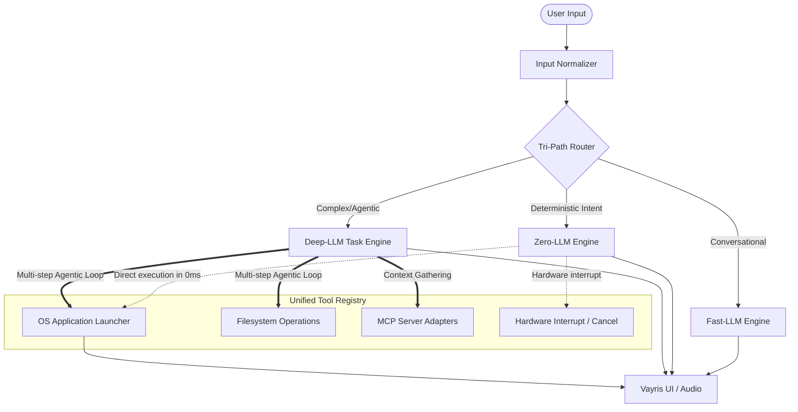

<div align="center">
  
  <h1>Vayris AI</h1>
  <p><b>An Advanced Local-First Agentic Operating Environment</b></p>
  
  [](https://opensource.org/licenses/Apache-2.0)
  [](https://nodejs.org/)
  []()
  []()
</div>

<br/>

**Vayris AI** is a next-generation, local-first AI assistant engineered to bridge the gap between deterministic computer control and deep, probabilistic reasoning. Designed from the ground up for privacy, minimal latency, and robust operating system integration, Vayris intelligently partitions workloads across a **Tri-Path Execution Architecture**.

Instead of relying on monolithic, high-latency cloud models for every interaction, Vayris introduces a sophisticated routing layer that dynamically selects the most efficient execution path for your request.

---

## 🧠 The Tri-Path Architecture

Vayris does not treat all user inputs equally. To achieve sub-second latency while maintaining complex reasoning capabilities, inputs are normalized and routed through one of three distinct paths:

1. **Zero-LLM (The Deterministic Path)**  
   For direct OS commands (e.g., *"Open Spotify"*, *"Cancel the current task"*), Vayris entirely bypasses the LLM layer. Using intent-recognition heuristics, it binds directly to the **Unified Tool Registry**, executing system actions in **~0ms**.
   
2. **Fast-LLM (The Conversational Path)**  
   For quick queries, conversational responses, and rapid data retrieval, Vayris routes to a lightweight local model (e.g., `llama3.2:1b`). This path provides immediate, low-latency conversational feedback.

3. **Deep-LLM (The Agentic Path)**  
   For heavy-lifting—such as multi-step planning, codebase refactoring, or complex research—Vayris shifts the workload to a large reasoning model (e.g., `qwen3:4b` or `deepseek-coder`). This engine operates asynchronously, chaining multiple tool calls, evaluating intermediate results, and recovering from errors.

### ⚡ The Unified Execution Context (Why Tools are Shared)

A defining architectural feature of Vayris is the **Unified Tool Registry**. You might wonder: *If Zero-LLM handles opening applications instantly, why does the Deep-LLM also have access to the exact same native tools? Is this a redundancy?*

**No, this is a deliberate and highly advanced design choice.** 
By decoupling the execution tools from the intelligence layer, both the deterministic router and the probabilistic reasoning engine can interact with the OS using the exact same robust APIs. 
- **When you say "Open Visual Studio"**, the Zero-LLM path triggers the `open_application` tool instantly.
- **When you say "Analyze my project, fix the bugs in `src/`, and then open my IDE to the fixed file"**, the Deep-LLM path formulates a plan, executes the filesystem changes, and *then autonomously calls that exact same `open_application` tool* as the final step of its agentic loop. 

This orthogonality ensures maximum flexibility: simple tasks execute with zero latency, while complex tasks still possess full control over your operating system.

---

## 📐 System Design Diagram



---

## 📂 Ecosystem & Repository Structure

To support a wide array of deployment environments, Vayris AI is structured as a monorepo containing two distinct clients powered by the same core architecture.

- [`/Vayris_App`](./Vayris_App) **(Native Desktop Environment)**  
  Built with Electron. This is the flagship Vayris experience. It runs directly on your machine with native Windows OS hooks, offering deep desktop integration, global hotkeys, and system-level process management.
  
- [`/Vayris_Web`](./Vayris_Web) **(Headless/Web Environment)**  
  A Vite/React-based web interface that connects to the Vayris backend running as a local server. Ideal for headless deployments, remote access over a local network, or lightweight usage without installing native binaries.

---

## ✨ Advanced Capabilities

- **Model Context Protocol (MCP) Integration:** Dynamically inject external capabilities (SQLite databases, remote file systems, APIs) into the agent's context window on the fly.
- **Hardware-Level Interrupts:** A true system-level cancellation mechanism. Abort a runaway Deep-LLM task instantly without crashing the state machine or corrupting memory.
- **Zero-Duplication Data Streaming:** Output streams are highly optimized to prevent context duplication and UI tearing during complex asynchronous tool executions.
- **Local-First & Air-Gapped:** Your data never leaves your machine unless you explicitly configure a remote provider. Complete privacy by design.

---

## 🚀 Getting Started

### 1. System Requirements
- **Node.js** (v18.x or higher)
- **Git**
- **Ollama** (Required for local LLM inference)

### 2. Choose Your Client

#### Deploying the Desktop Application (Recommended)
Navigate to the App directory to install and start the native Electron experience:
```bash
cd Vayris_App
npm install
npm start
```
*(Refer to [`Vayris_App/README.md`](./Vayris_App/README.md) for detailed build and packaging instructions).*

#### Deploying the Web Service
Navigate to the Web directory to spin up the local server and web interface:
```bash
cd Vayris_Web
npm install
npm run start
```
*(Refer to [`Vayris_Web/README.md`](./Vayris_Web/README.md) for detailed environment configuration).*

### 3. Environment Configuration

Vayris relies on environment variables for model routing and MCP configurations. Copy the template in your chosen directory:

```bash
cp .env.example .env
```
Ensure Ollama is running and your designated FAST and DEEP models are pulled (e.g., `ollama pull llama3.2:1b` and `ollama pull qwen3:4b`).

---

<div align="center">
  <b>Built for the future of human-computer interaction.</b><br/>
  <sub>Licensed under the Apache License 2.0</sub>
</div>
